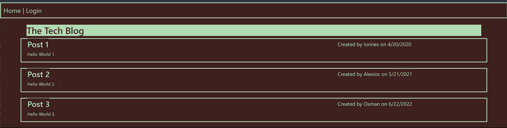
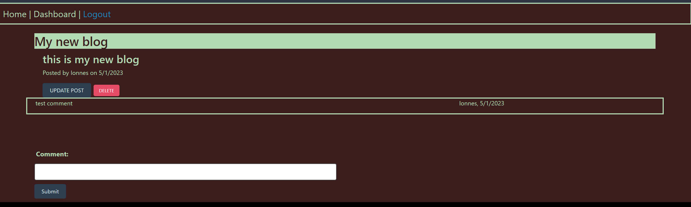

# Tech-Blog

## Description
    
This Project is a full-stack Tech Blog that allows users to post blogs as well as comment on the blogs of other users. It is built with javascript with a SQL backend. It uses the following libraries: express, sequelize, dotenv, mysql2, bcrypt, connect-session-sequelize, express-handlebars, and express-session.
    
## Installation

Users will need to install the npm libraries as defined in the included package.json file. Also please create a .env file including entries for the techblog_db database as well as your mysql username and password. The 
Set-Up CLI Commands from project root directory:
>npm i  
>cd db 
>mysql -u root -p // when prompted enter your mysql password 
>SOURCE schema.sql 
>cd .. 
>npm run seed 

## Usage

Server is initialized from command line with:
>node server.js
Once you begin the program, you will be prompted to login or create an account when you attempt any action. Once logged in you will be taken to your dashboard that will show your current Blogs. You can also click the Home tab from the nav bar at the top of the interface to see all Blog posts by other users. Once you click on a Blog post you will be able to post a comment on it. All comments will be displayed in the order they were posted - including by the original Blog poster. 

If you click on one of your own Blogs, you will have the additional options to either edit or delete your Blog. 

Screenshots of the program in use:
  

## License

This Project is covered by the following license: GNU General Public License v3.0.

## Contributions

While there was no starter code provided, I leaned heavily on previous assignments, including the miniproject as well as prior activities. My purpose was to further familize myself with the various ways to implement the required backend functionality.

Instruction was provided by Instructor Saurav with assistance from TAs Andreas #1, Andreas #2, Constan, and Morgan. 

## Tests

The Project may tested using the installation instructions above and running 'npm run start' and then opening <http://localhost:3001> in any browser. The live site is available at: <https://calm-headland-52008.herokuapp.com/>.

## Questions

My GitHub username is JaminHLO and my repository is available here: <https://github.com/JaminHLO/>.
If you have any questions please contact me at <jamin.hogan@gmail.com>.
